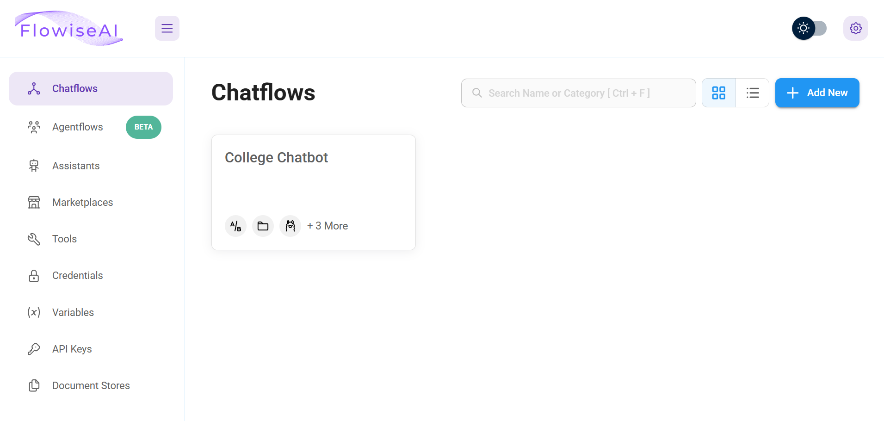
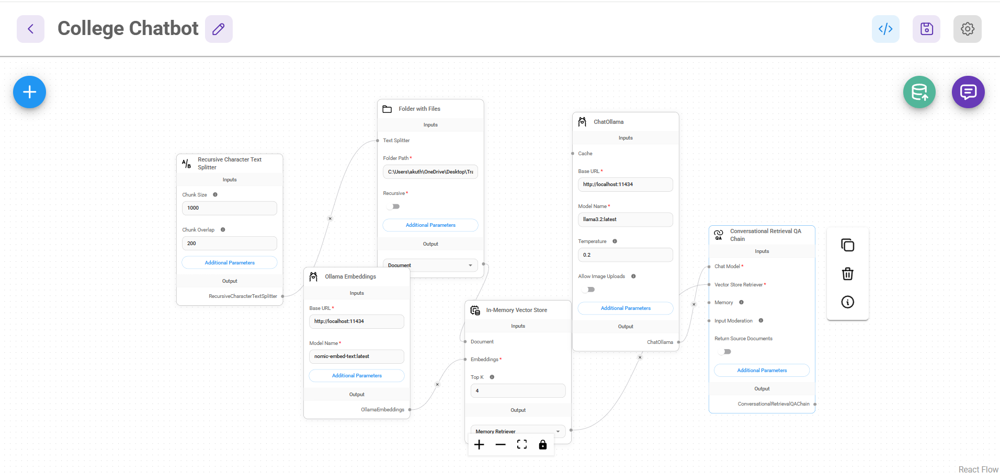
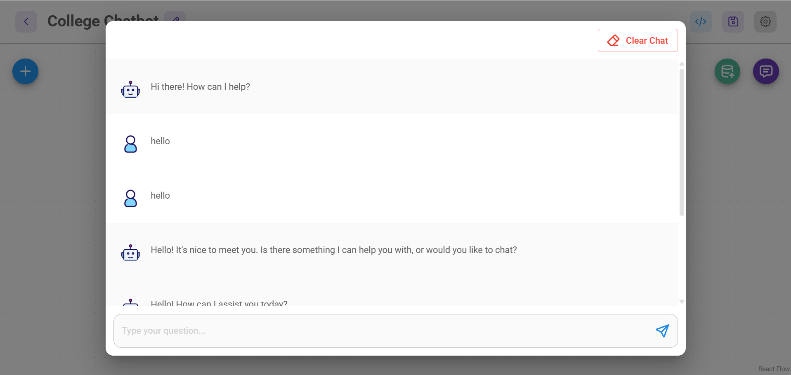
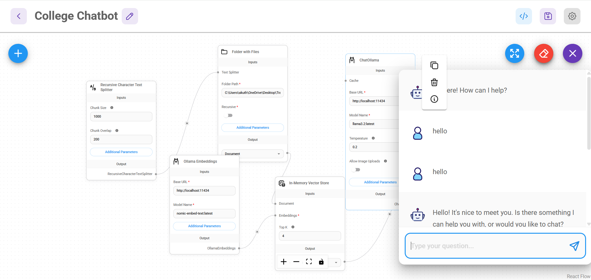

# chatbot
chatbot built using Flowise and Ollama
# College Chatbot using Ollama and Flowise

A local AI chatbot that answers questions from college documents.

## Built with
- Flowise
- Ollama
- Llama 3.2
- Nomic Embed Text embeddings
- In-Memory Vector Store
- Conversational Retrieval QA

## Project files
- `college-chatbot.json` — Flowise chatflow configuration
- `chatbot-workflow.png` — Chatbot workflow
- `chatbot-demo.png` — Chatbot demo

## Run locally
1. Install Ollama.
2. Run:

   ```bash
   ollama pull llama3.2
   ollama pull nomic-embed-text
   ollama serve
 ## Screenshots

### Flowise Chatflows


### Chatbot Workflow


### Chatbot Demo

### Workflow and Live Chat Demo

